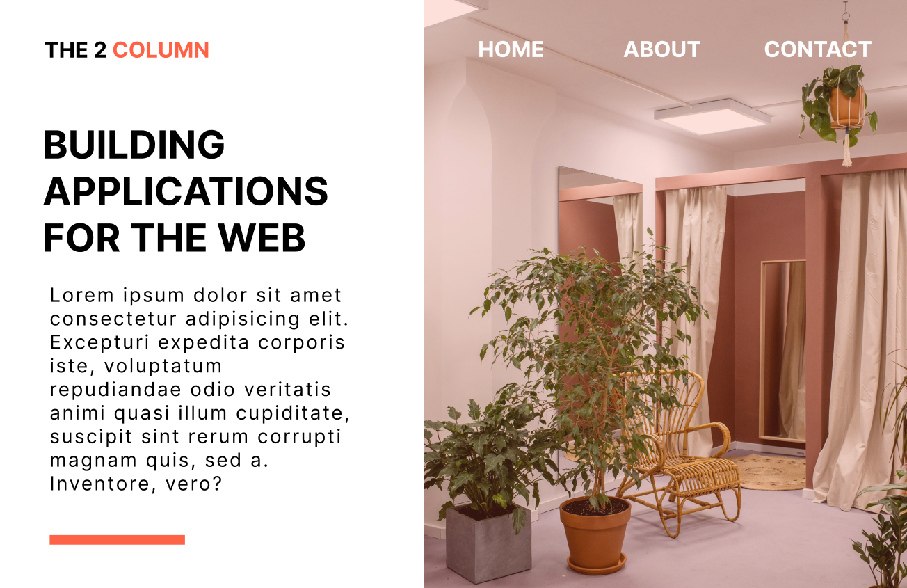

# DX-Column-Design

## Netlify Link
- https://dx1columndesign.netlify.app
## Figma Design link
- https://www.figma.com/file/ufZTvBzIwRwb62WGnLsom5/DX1.0-column-design?node-id=22%3A2
## Youtube Tutorial Link

# Steps to use Application
- Download Entire code
- Open the Index.html file in final folder

Feel free to edit and use as you like, You can also reach out to me, if you need help making it work. cheers 

# Technologies Used
- HTML
- CSS [ Styling ]
- Fontawesome [ Icons ]

## Special Thanks

Partners
- De whales Organization
